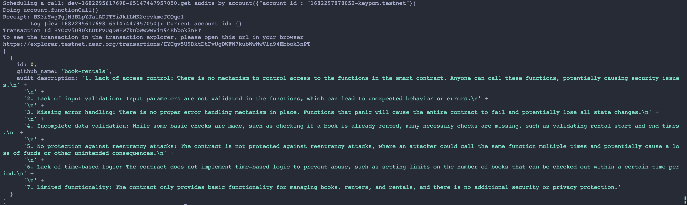

# SmartContract GPT

Here is the demo of the contract auditing (apologies for the bad UI!)

Here is the screenshot of the audit being stored on chain:

Here is the demo of creating the trial account, it being stored on a SQL database and the actual trial account being created on testnet! So cool!

This is a proof of concept project for an automated smart contract auditing service powered by ChatGPT.

I leveraged KeyPom technology to implement trial accounts. I give users a limited amount of NEAR to try out audits and to store each audit logs on the blockchain.

## The problem

While attending ETHDenver, I met a project founder who paid a company USD 100,000 for a smart contract audit when they had barely any users and had not yet found product market fit. While talking with others in the space, I found out other companies charge similar amounts for auditing smart contracts.

Although it is important to consider the security of your smart contract when implementing a web3 product, it is a lot of money to be paying for a security when you have low volume and not a lot of cryptocurrency values stored in a wallet. This represented a gap to me for a smart contract developer who wants to ensure that they are not missing anything stupid from a security standpoint prior to launching their product.

Furthermore, current audits only occur at a single point of time, and for a specific version of the smart contract. What would happen if a developer adds more features? What happens if a developer refactors their code in the smart contract? They will have to pay the auditing firm more money to audit their code again.

Thus, the idea of using an LLM (i.e. ChatGPT) to audit your smart contract was born. By leveraging chatGPT, we can develop a cheap and easy solution for developers to ensure there is a base level of security throughout the development journey.

## Potential Next Steps

1. Review more smart contract audits for what are common security issues
2. Build out a soulbound token or an NFT badging system to know that a specific smart contract has been audited for security.
3. Review LLMs and possibly build out our own LLM that is customized with our training data
4. Review how to train to handle system level security (currently it is all low level, and the code must be in a single file)
5. Revamp UI/UX to make it more intuitive to navigate
6. Review security. We are currently storing a keypom account and secret key with an associated github account on a DB with no hashing.
